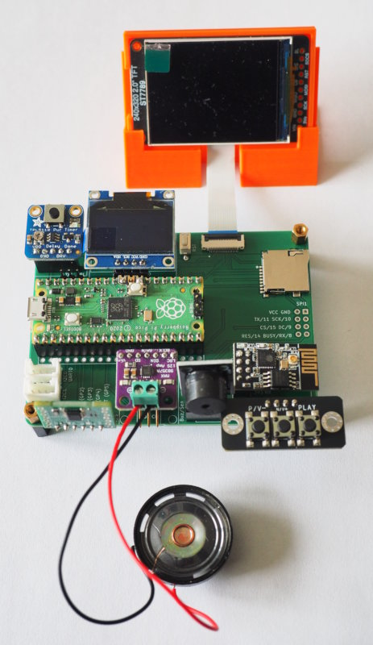
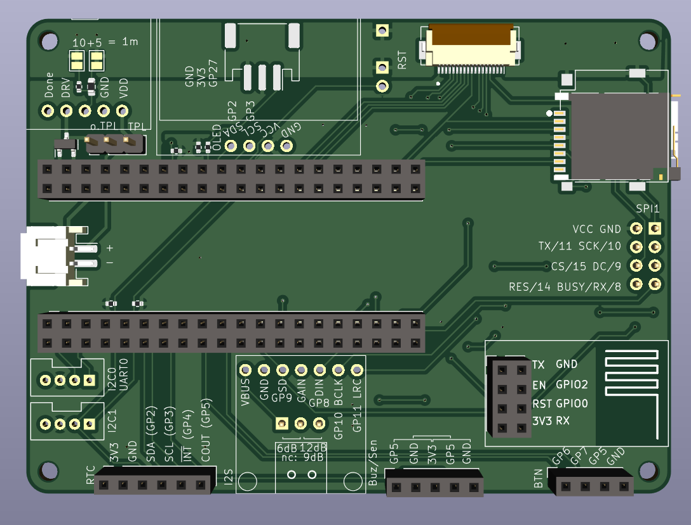

Protoyping Board for the Raspberry Pi Pico
==========================================

This is a small prototyping board for the Pico. Besides
the normal 2x20 through holes for the Pico, the PCB also
provides additional sockets for the connection of peripherals.

The idea of this board is to simplify software-development
for standard breakouts, because it provides sockets for
these components and thus no wiring is necessary.

Some supported components:

  - Mini-I2C-OLED
  - EYESPI (typically for SPI-displays)
  - 2x Grove (I2C0/UART0 and I2C1)
  - ESP-01S or Lilygo T-01 C3
  - passive buzzer
  - MAX98357A (I2S mono-amplifier)
  - button-breakout (3xbutton, 1xGND)
  - RTC-socket (for <https://github.com/bablokb/pcb-pico-pcf8563.git>
  - Adafruit TPL5110 power-switch breakout
  - SD-card socket (on-board)
  - JST-PH2 battery connector
  - JST-PH3 connector (ADC)

Ready to use Gerber, BOM and POS files for JLCPCB are in the subdirectory
"production_files".

Schematic
---------

Layout
------

3D-Views
--------

License
-------

[![CC BY-SA 4.0][cc-by-sa-shield]][cc-by-sa]

This work is licensed under a
[Creative Commons Attribution-ShareAlike 4.0 International
License][cc-by-sa].

[![CC BY-SA 4.0][cc-by-sa-image]][cc-by-sa]

[cc-by-sa]: http://creativecommons.org/licenses/by-sa/4.0/
[cc-by-sa-image]: https://licensebuttons.net/l/by-sa/4.0/88x31.png
[cc-by-sa-shield]:
https://img.shields.io/badge/License-CC%20BY--SA%204.0-lightgrey.svg
